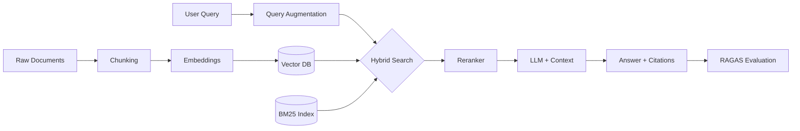

# Week 4 — RAG & Hybrid RAG

> **"Your LLM is only as good as what you put in its context."**  
> — This week you take control of that context.

---

## What You'll Build This Week

By the end of Week 4, you will have built a **production-grade RAG pipeline** that can answer questions over any document corpus. You'll go from "stuff everything in the prompt" to a proper two-stage retrieve-then-generate system with evaluation metrics to prove it works.

---

## Topics at a Glance

| # | Topic | What You Learn |
|---|-------|----------------|
| 01 | [Chunking Strategies](./chunking-strategies) | How to split documents intelligently |
| 02 | [Vector Databases](./vector-databases) | FAISS, ChromaDB, Qdrant, PGVector — when to use what |
| 03 | [Hybrid Search](./hybrid-search) | Dense + Sparse retrieval, BM25, RRF fusion |
| 04 | [Query Augmentation](./query-augmentation) | HyDE, query rewriting, step-back prompting |
| 05 | [Reranking](./reranking) | Cross-encoders, Cohere Rerank, ColBERT |
| 06 | [RAGAS Evaluation](./ragas-evaluation) | Measuring your RAG with faithfulness, precision, recall |
| 07 | [Multimodal Embeddings](./multimodal-embeddings) | ColPali, CLIP, embedding images + text together |
| 08 | [LLM Grounding](./llm-grounding) | Source attribution, citations, hallucination control |
| 09 | [Late Chunking](./late-chunking) | Jina AI's token-level pooling trick |
| 10 | [GraphRAG](./graphrag) | Microsoft's entity graph approach |
| 11 | [Contextual Retrieval](./contextual-retrieval) | Anthropic's chunk-level context injection |
| 12 | [Semantic Caching](./semantic-caching) | Avoid redundant LLM calls with cosine-threshold caching |

---

## Labs & Capstones

| Type | Name | Key Tech |
|------|------|----------|
| `CAPSTONE` | [BS Degree Chatbot](../labs/week-4/capstone-bs-degree-chatbot) | Hybrid RAG · RAGAS · FastAPI |
| `CAPSTONE` | [Policy Chatbot](../labs/week-4/capstone-policy-chatbot) | NeMo Guardrails · Google Auth |
| `LAB` | [RAGAS Evaluation Dashboard](../labs/week-4/ragas-evaluation-dashboard) | Naive RAG vs Hybrid RAG vs Contextual |

---

## Why RAG?

LLMs have a fixed knowledge cutoff and a finite context window. RAG solves both problems:

- **Knowledge cutoff** → pull fresh documents at query time
- **Hallucination** → ground answers in retrieved evidence  
- **Context limits** → retrieve only what's relevant (not the full corpus)
- **Cost** → cheaper than fine-tuning for every new document set

The naive approach (paste all documents into prompt) breaks at scale. This week you build the proper pipeline.

---

## Prerequisites

Make sure you've done Week 3. You'll need:
- Basic LLM API calls (OpenAI / Anthropic)
- Understanding of embeddings and cosine similarity (Week 3 → Vector Embeddings)
- Python + FastAPI basics
